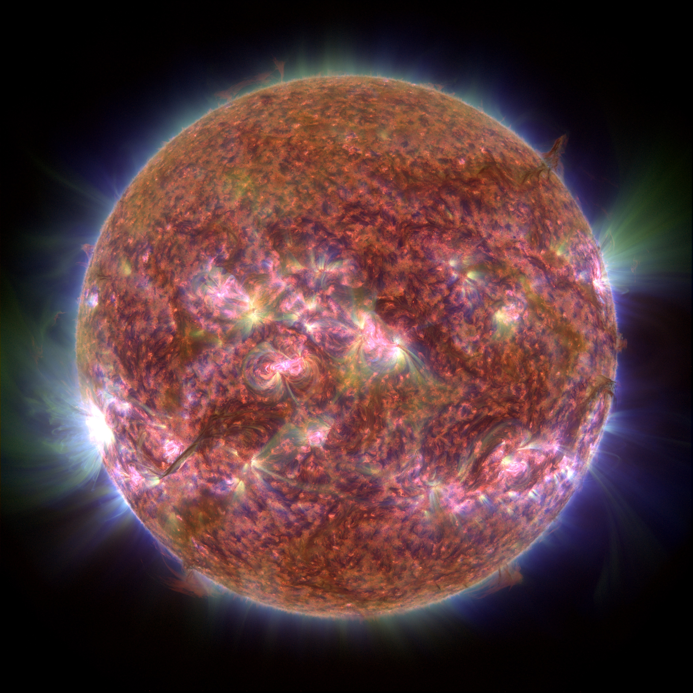

# aia-reloaded
We are a group of solar physicist working with the Solar Dynamics Observatory. Our goal is to deliver a new view of our nearest star through the combination of advanced image processing methods with more awareness on how we, as humans and scientists, associate color with information. 

This repository provides python scripts and functions to create calibrated and enhanced RGB image series and movies from the full resolution images of SDO/AIA at 3 different wavebands. 

## Installation

Download and unpack files into an empty parent directory.

Main dependencies:

* numpy
* astropy
* opencv
* multiprocessing (optional, for parallel processing)
* functools (if using multiprocessing)

 
If you wish to run the test functions with **pytest**: 

* create an **aia_data** directory in the parent directory

* Download the 3 test raw AIA fits files and place them into the **aia_data** directory:
  * https://drive.google.com/open?id=1-qT9RFb8NXFWlhbvNVVXm52JJ0cjLJyV
  * https://drive.google.com/open?id=1NCVU91LQoFfmZMdg9eFec6nzdDf6q7Qx
  * https://drive.google.com/open?id=1lCoKH_BghuCuFwsrTVbtBz76ynVG_NQP
  
* To fully automate the video creation from the rgb image series, you will need to install **ffmpeg**(https://www.ffmpeg.org)
  
### How does it work? 

This framework assume you know how to download the raw fits files from SDO/AIA. 
An example of the rgb image processing is given in aia_rgb_images.py. It processes the raw fits files by rescaling each channel which correspond to one waveband. Our examples use the wavebands centered at 304 (red channel), 171 (green channel) and 193 Anstrom (blue channel).
The assignment of these wavebands to these colors is chosen in accordance to general human perception of colors. This is a singular attempt that aims at maximizing our ability to observe the dynamic of the plasma at different temperatures moving across the solar atmospheres. 